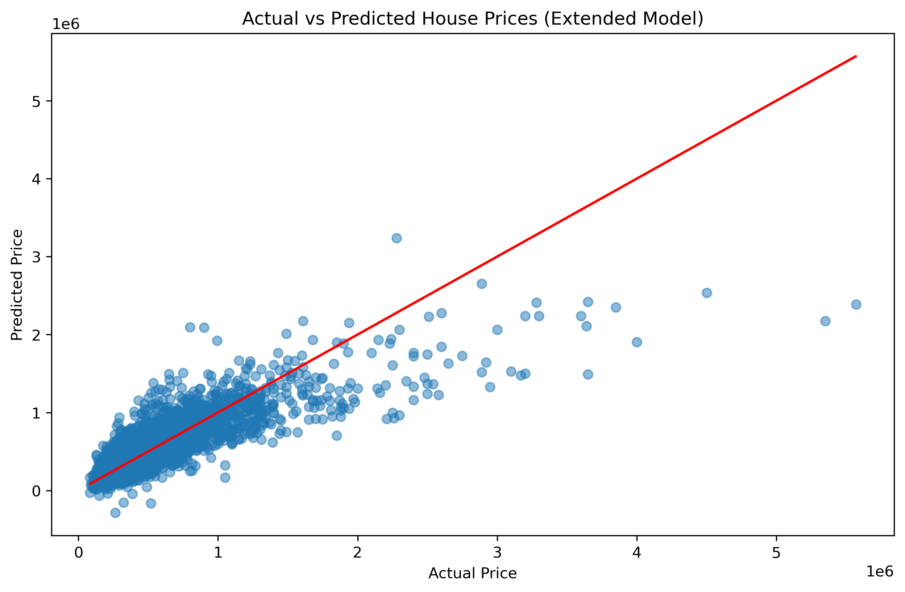

# House Price Prediction in King County, USA

## Project Overview
This project explores a housing dataset from King County, USA, with the objective of predicting house prices using linear regression techniques. The analysis examines how various housing attributes such as square footage, number of bedrooms, bathrooms, and location-related features influence property prices.

The project progresses from exploratory data analysis to building and evaluating multiple regression models, demonstrating a structured and data-driven approach to price prediction.

## Dataset
- Dataset contains **21,613 observations** with **no missing values**
- Includes **18 features**, such as:
  - Bedrooms
  - Bathrooms
  - Square footage (living area, lot size, above ground, basement)
  - Floors
  - View and waterfront indicators
  - Year built and renovation year
  - Geographic features (zipcode, latitude, longitude)

Target variable:
- **Price** (ranging from $75,000 to $7,700,000)

## Methodology

### Exploratory Data Analysis (EDA)
- Conducted correlation analysis to identify key predictors
- Strong positive correlations observed between:
  - `sqft_living`
  - `grade`
  - `sqft_above`
  and house prices

### Model Development
1. **Simple Linear Regression**
   - Predictor: `sqft_living`
   - R² score: **0.494**

2. **Multiple Linear Regression**
   - Included features such as bedrooms, bathrooms, floors, waterfront, view, condition, grade, and square footage variables
   - R² score improved to **0.614**

3. **Extended Linear Regression**
   - Added `zipcode`, `yr_built`, and `yr_renovated`
   - Achieved an R² score of **0.652**
   - Cross-validation mean R²: **0.646**

## Model Evaluation
- Models evaluated using:
  - Mean Squared Error (MSE)
  - R-squared (R²)
- Cross-validation used to assess robustness and generalization

## Results & Model Performance

Three linear regression models were developed and evaluated to assess predictive performance.

### Model Comparison
- **Simple Linear Regression (sqft_living only)**
  - R² ≈ **0.49**
  - Indicates a moderate relationship between living area and house price.

- **Multiple Linear Regression**
  - R² ≈ **0.61**
  - Including additional structural features significantly improves prediction accuracy.

- **Extended Linear Regression**
  - R² ≈ **0.65**
  - Cross-validation mean R² ≈ **0.65**
  - Incorporating location and time-based features provides the strongest performance.

### Key Takeaways
- The models effectively capture general pricing trends, particularly for mid-range properties.
- Prediction accuracy decreases for higher-priced homes, suggesting increased variability and potential non-linear effects.
- The extended model explains approximately **65% of the variance** in house prices, making it a strong baseline model.

## Results & Visualization

### Actual vs Predicted Prices (Extended Model)

The scatter plot below compares actual house prices with predicted prices from the extended linear regression model.  
The red line represents the ideal scenario where predicted prices exactly match actual prices.

- Predicted prices generally follow the trend of actual prices
- The model performs well for mid-range prices
- Reduced accuracy observed at higher price points, indicating increased variability

## Discussion
### Strengths
- Demonstrates clear relationships between housing features and price
- Structured regression modeling approach
- Good baseline predictive performance

### Limitations
- Linear regression struggles with non-linear relationships
- Higher-priced properties show greater prediction variance

### Future Improvements
- Polynomial regression for non-linearity
- Regularization techniques (Ridge, Lasso)
- Advanced models such as Random Forest or Gradient Boosting

## Tools & Technologies
- Python
- Pandas
- NumPy
- Matplotlib / Seaborn
- Scikit-learn

## Conclusion
This project provides insight into the factors influencing house prices in King County and demonstrates the application of linear regression for predictive modeling. While the extended model offers reasonable performance, more advanced techniques could further improve accuracy in complex real estate markets.
